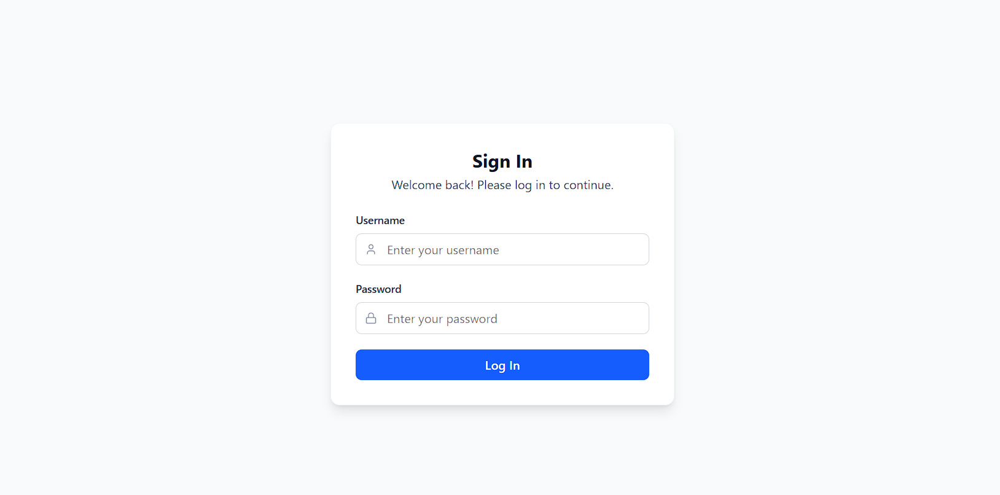
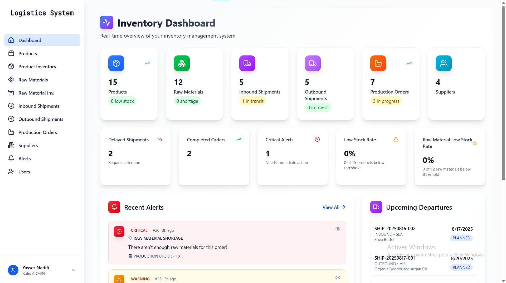
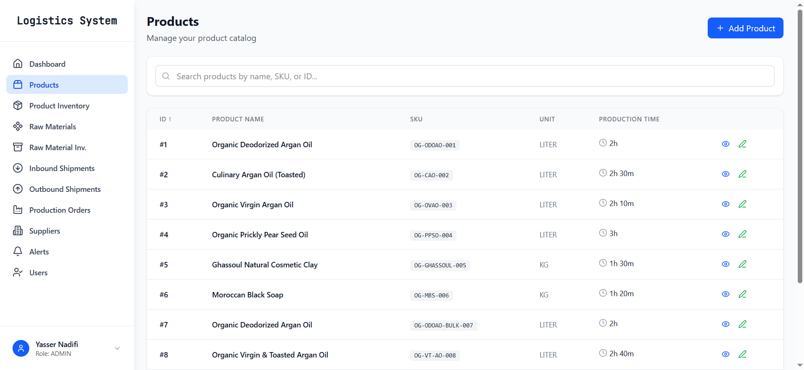
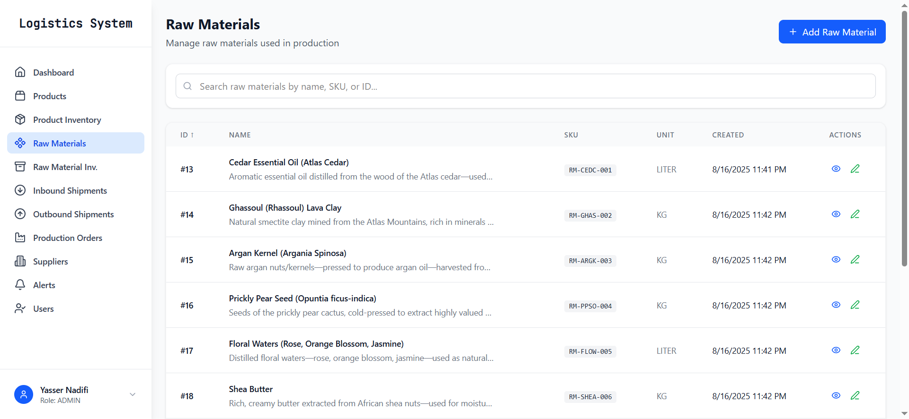
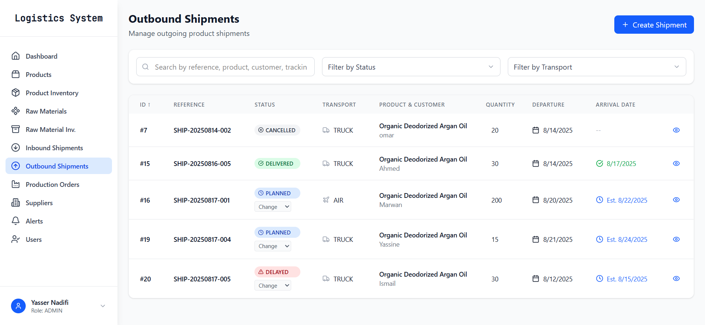
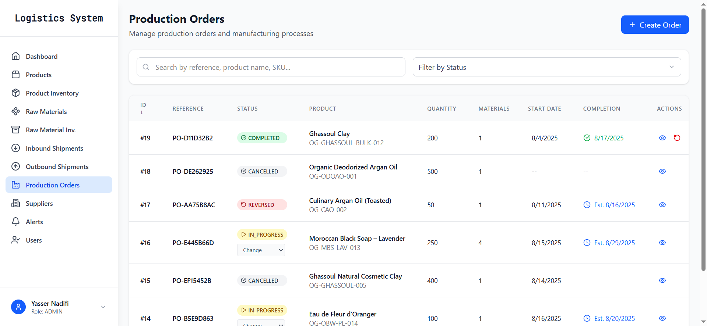
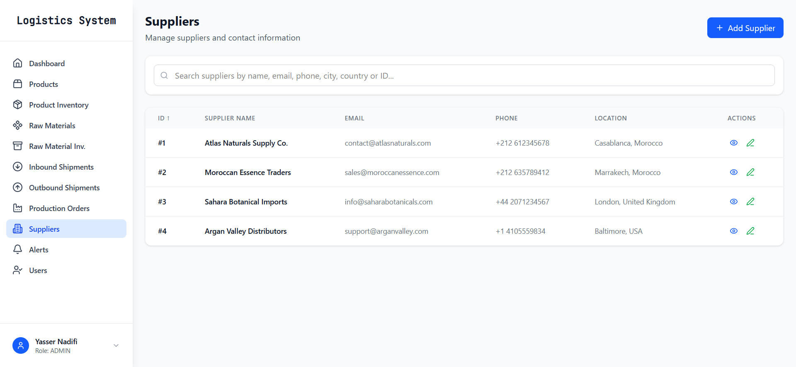
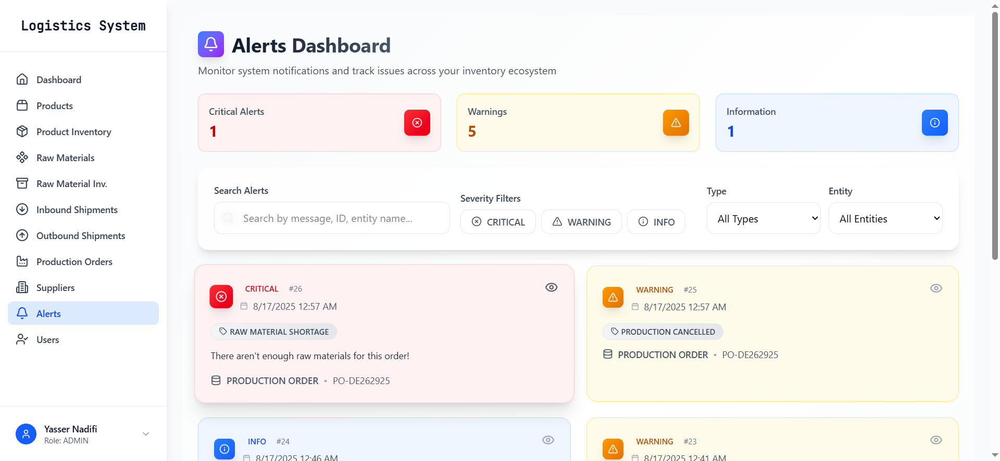
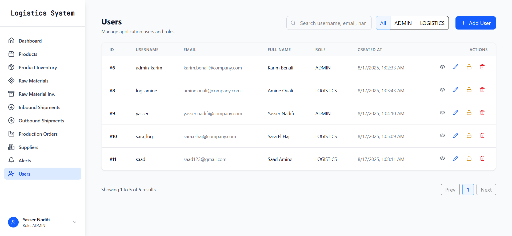

# 📦 Logistics & Inventory Management Platform

A full-stack web application designed to streamline **inventory tracking**, **production planning**, and **logistics supervision**.  
The platform centralizes operations related to raw materials, finished products, shipments, and alerts, enabling organizations to better coordinate their supply chain activities and respond quickly to unexpected events.

---

## 🚀 Features

- **Dashboard Overview**
  - Real-time KPIs: stock levels, ongoing shipments, production orders, suppliers, and critical alerts.
  - Highlights delayed shipments, completed orders, and stock shortages.

- **Product Management**
  - Manage finished product catalog (name, SKU, unit, production time, description).
  - Role-based access: only admins can create or edit products, others have read-only access.

- **Inventory Tracking**
  - Track real-time stock of finished products and raw materials.
  - Automatic generation of inventory entries when products or materials are added.
  - Threshold management with alerts for shortages.

- **Raw Materials Management**
  - Full catalog of raw materials (name, SKU, unit, description).
  - Add, edit, and view details with role-based permissions.

- **Production Orders**
  - Create and manage production orders linked to raw materials and finished products.
  - Track statuses and transitions (created, in progress, completed).

- **Shipments**
  - Manage incoming raw material shipments and outgoing product shipments.
  - Detailed tracking by status, transport mode (truck, sea, air), supplier/customer, and dates.

- **Alerts & Notifications**
  - Automatic alerts for shortages, delays, or cancellations.
  - Severity levels and linked entities (production orders or shipments).

- **User & Role Management**
  - Admin panel for managing users, roles, and access.
  - Support for different user profiles: **Admin** and **Logistics Manager**.

---

## 🛠️ Tech Stack

- **Frontend:** [React](https://react.dev) + [Tailwind CSS](https://tailwindcss.com)  
- **Backend:** [Spring Boot](https://spring.io/projects/spring-boot) (REST API)  
- **Security:** [Spring Security](https://spring.io/projects/spring-security)  
- **Database:** [MySQL](https://dev.mysql.com/doc/) with JPA ([Spring Data JPA](https://spring.io/projects/spring-data-jpa))  
- **Tools:** Postman (API testing), Git (version control)  

---

## 📂 Project Structure

- `frontend/` → React application with Tailwind UI components  
- `backend/` → Spring Boot application (REST API + JPA + Security)  
- `database/` → MySQL schema & migrations  

---

## 📸 Screenshots

### 🔐 Login

### 📊 Dashboard

### 📦 Product Management
  

### 🧾 Raw Materials

### 🚚 Shipments
- **Outbound Shipments**

- **Inbound Shipments**

### 🏭 Production Orders

### 👥 Suppliers

### ⚠️ Alerts

### 👤 Users (Admins Only)

